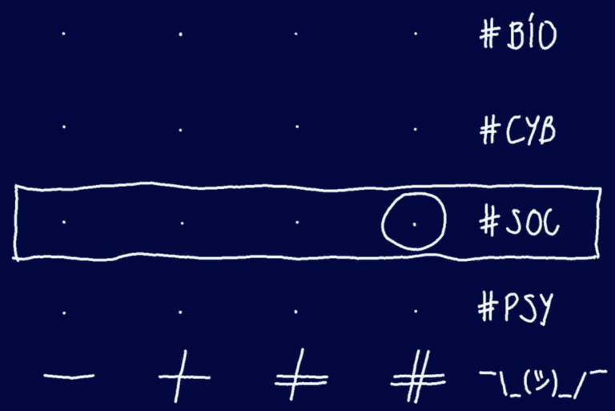

# Allgemein

-   [11min srf radiobeitrag](https://www.srf.ch/audio/kontext/stefan-m-seydel-wiki-dissident-aus-dissent-is?partId=11900054)

-   [Wikipedia sms](https://als.wikipedia.org/wiki/Stefan_M._Seydel)

-   [Wikipedia rebelltv](https://de.wikipedia.org/wiki/Rebell.tv)

# Dissent.is

### RechercheUrsache/Konfrontation 16.12.2023

-   [Twitter/X](https://x.com/sms2sms/status/1731569535444983909?s=20)

## LuhmannMap

-   [https://dissent.is/2022/09/27/4r4r/](rules4radicals.html)

-   [klick](https://drive.google.com/file/d/1axbGQ3XAHO2pClEATOyz7H1-vzZnrfO2/view?pli=1)

-   [klick2](https://luhmann.ir/wp-content/uploads/2021/07/Die-Gesellschaft-der-Gesellschaft-1.pdf)

### Außerdem:

-   [dissent.is letzte generation](https://dissent.is/2023/09/18/letztegeneration/)

## Aby Warburg + "workflow"

-   [dissent.is aby warburg](https://dissent.is/?s=aby+warburg)

-   [Die Form der Unruhe 2 (Abschnitt 5)](https://dissent.is/wp-content/uploads/sites/2/2020/11/dfdu_Band_2.pdf)
